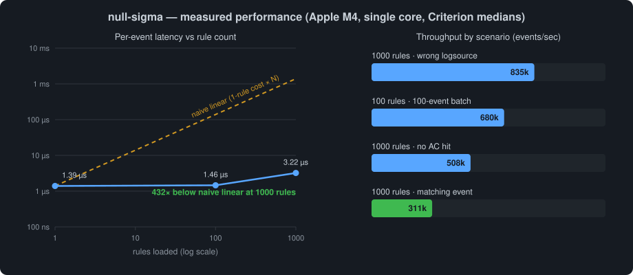
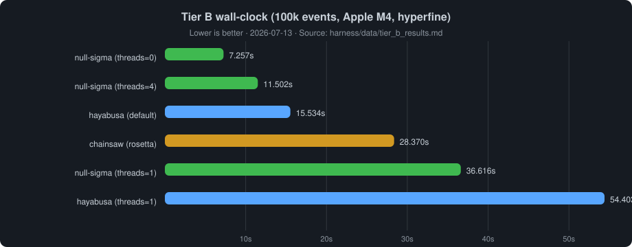

# null-sigma — Sigma engine (Tier B wall-clock winner)


[](https://github.com/Gh0st-La6z-exe/null-sigma/actions/workflows/ci.yml)
[](https://crates.io/crates/null-sigma)
[](https://docs.rs/null-sigma)
[](LICENSE)

A pure-Rust [Sigma](https://sigmahq.io) rule evaluation engine.

Parse YAML rules once, compile them into an optimised internal representation,
then evaluate streams of security events against the full rule set at
**311 000 events/sec × 1 000 synthetic rules on a single core** (Apple M4,
release, microbenchmark suite). Against 1 102 real SigmaHQ `process_creation`
rules the measured rate is **~3 230 events/sec** — see
[Head-to-head benchmarks](#head-to-head-benchmarks) below.

```toml
[dependencies]
null-sigma = "0.1"
```

**Published library:** [`null-sigma` 0.1.3](https://crates.io/crates/null-sigma)
on crates.io · [docs.rs](https://docs.rs/null-sigma/0.1.3/null_sigma/).
Repo tooling since that release (harness trust, product CLI) lives under
`[Unreleased]` in `CHANGELOG.md` and does **not** bump the library until a
core API change ships.

| Package | Version | Publish | Role |
|---|---|---|---|
| `null-sigma` | **0.1.3** | crates.io / docs.rs | Core engine (this crate) |
| `null-sigma-cli` | 0.1.0 | `publish = false` | Product JSONL → alerts (`cli/`) |
| `null-sigma-harness` | 0.1.0 | unpublished | Tier A/B benches + trust runner |

---

## Quick start

```rust
use null_sigma::SigmaEngine;
use std::collections::HashMap;

let yaml = r#"
title: Detect Encoded PowerShell
logsource: {}
detection:
    sel:
        CommandLine|contains: '-EncodedCommand'
    condition: sel
"#;

let mut engine = SigmaEngine::new();
engine.load_rule(yaml).unwrap();

let mut event = HashMap::new();
event.insert("CommandLine".to_string(), "powershell -EncodedCommand SQBFAFgA".to_string());

let matches = engine.evaluate_event(&event);   // &self — safe to call concurrently
assert_eq!(matches[0].rule_title, "Detect Encoded PowerShell");
```

```text
$ cargo run --example detect_powershell

Loaded rule: d7da0a5c-0001-0000-0000-000000000001
Engine has 1 rule(s)

[ALERT] Matched 1 rule(s)
  - Suspicious Encoded PowerShell  [high]  score=0.70
    tags: attack.execution, attack.t1059.001

Batch (2 events):
  event[0]: 1 match(es)
  event[1]: 0 match(es)
```

### Product CLI (`null-sigma-cli`)

JSONL in, lean NDJSON alerts out — Week 1 trust contract, path-install only
until crates.io publish (ROADMAP §4):

```bash
cargo install --path cli
null-sigma-cli --rules ./rules < events.jsonl
# or: null-sigma-cli --rules ./rules events.jsonl --format text
```

Details and flags: [`cli/README.md`](cli/README.md). Trust smoke:
`cd cli && ./scripts/smoke_trust.sh`.

The harness binary `null_sigma_run` remains the Tier B **count-only** bench
runner (`harness/`); it is not the installable product CLI.

---

## Why it's fast

The engine achieves its throughput through four compounding optimisations.
Each one is independently measurable in the benchmark suite.

### 1 — Hot/cold struct split

The most expensive operation in a multi-rule engine is the per-rule loop: for
each loaded rule, decide as cheaply as possible whether the current event can
possibly match.

The naive approach is to store everything about a rule in one struct and
iterate it. At 200–500 bytes per rule, 1 000 rules = 200–500 KB of data
streamed per event — a guaranteed L2/L3 cache miss on every iteration.

Instead, the engine separates each rule into two regions:

**`RuleHotData`** — 24 bytes, touched on every event for every rule:

```rust
struct RuleHotData {
    cat_hash:         u32,   //  4 bytes — FNV-1a hash of logsource.category
    prod_hash:        u32,   //  4 bytes — FNV-1a hash of logsource.product
    svc_hash:         u32,   //  4 bytes — FNV-1a hash of logsource.service
    ac_start:         u32,   //  4 bytes — index into flat AC pattern slice
    ac_len:           u32,   //  4 bytes — number of AC patterns for this rule
    fully_ac_covered: bool,  //  1 byte  — safe-skip gate
                             //  3 bytes padding → total 24 bytes
}
```

**`CompiledRule`** — 200–500 bytes, dereferenced only when a rule passes
*both* prefilters (typically 1 of 1 000):

```rust
struct CompiledRule {
    rule:               SigmaRule,          // parsed YAML fields
    identifiers:        Vec<SearchIdentifier>,
    conditions:         Vec<ConditionNode>, // compiled boolean AST
    ac_pattern_indices: Vec<usize>,
    has_regex:          bool,
}
```

At 24 bytes/rule, 1 000 rules occupy 24 KB — fitting inside L1 cache (64 KB
on Apple M4). The entire prefilter scan touches only this array; the cold
`CompiledRule` heap allocations are never dereferenced for skipped rules.

The logsource fields are pre-hashed with 32-bit FNV-1a at rule load time so
the per-rule check is three integer comparisons, not three string comparisons:

```rust
#[inline(always)]
fn logsource_ok(rule_hash: u32, event_hash: u32) -> bool {
    rule_hash == 0 || (event_hash != 0 && rule_hash == event_hash)
    //           ↑                    ↑
    //      wildcard rule        field absent in event
}
```

0 is reserved as the "no constraint" sentinel. Non-zero event hashes are
guaranteed by remapping the FNV collision `h == 0 → 1`.

The hash comparison is a prefilter, not the final word: rules that pass it
are re-checked against the **actual logsource strings** on the cold path
(`LogSource::matches`) before evaluation. A 32-bit hash collision therefore
cannot route an event to the wrong rule — the recheck costs nothing on the
hot path because it only runs for rules that already passed both prefilters.

**Measured result:** 1 000 rules, event with wrong logsource category →
**912 ns** total. All 1 000 rules are rejected before a single `CompiledRule`
is touched.

---

### 2 — Aho-Corasick batch prefilter

Most Sigma rules contain one or more `|contains`, `|startswith`, or
`|endswith` string conditions. If the event field doesn't contain any of those
strings the rule cannot match — no need to evaluate the full condition AST.

At rule load time, every AC-eligible string pattern from every rule is
extracted into a single flat `Vec<String>`. A single
[`aho-corasick`](https://docs.rs/aho-corasick) automaton is compiled across
all of them. At evaluation time:

```
run_ac_scan(event)
  for each event field value:
    for each match in ac_automaton.find_iter(value):
      hits[match.pattern_id] = true   // O(n) over text, not O(n × rules)
```

The result is a dense boolean bitmap indexed by pattern ID. The hot loop then
tests a contiguous slice of that bitmap per rule — no pointer indirection, no
HashMap lookup:

```rust
let start = hot.ac_start as usize;
let end   = start + hot.ac_len as usize;
if !flat_ac_indices[start..end]
    .iter()
    .any(|&idx| ac_hits[idx as usize])
{
    continue;   // rule cannot match — skip cold eval
}
```

**Why AC prefilter scaling changed (2026-07-07):** After fixing overlapping-scan
false negatives (§11.2), the automaton correctly reports all substring matches.
On synthetic rules with shared vocabulary, 100 rules can be *slower* than 1 rule
because more patterns fire the prefilter — but correctness is preserved. Real
SigmaHQ rules rarely achieve full AC coverage; see §6b for measured corpus numbers.

| Benchmark | Median (2026-07-07) |
|---|---|
| `single_rule_single_event` | 1.39 µs |
| `100_rules_single_event` | 1.46 µs |
| `1000_rules_single_event` | 3.22 µs |

The AC automaton scans the event field once regardless of rule count. One
hundred rules sharing overlapping string vocabularies means 100 rules get
prefiltered for less total work than naively evaluating one rule's conditions.

A rule is only AC-prefiltered when two safety conditions hold:

1. **Every** field condition in **every** identifier group is AC-eligible.
   Rules containing `|re`, `|cidr`, numeric comparisons, `|exists`, or
   transform modifiers (`|base64`, `|wide`, `|windash`) bypass the prefilter
   gate and always proceed to full evaluation.
2. The compiled condition **cannot fire with all identifiers false**. This
   protects negated conditions such as `condition: not selection` — an event
   with zero AC hits can be exactly the event that should match, so those
   rules are never skipped on an AC miss.

Both checks are computed once at rule load time; violating either would
produce false negatives, so they are enforced by dedicated regression tests
(`ac_prefilter_tests`).

---

### 3 — Pre-compiled regex cache

Rules using `|re` (regex) conditions have their patterns compiled once at
`load_rule` time into a per-rule `HashMap<String, Regex>`. At evaluation time,
`match_identifier_with_cache` looks up the pre-compiled object directly:

```rust
match regex_cache.get(&pattern) {
    Some(re) => re.is_match(field_value),   // O(1) lookup + fast match
    None     => regex_matches(&pattern, field_value), // fallback compile
}
```

Compilation is also where validation happens: a `|re` pattern that fails to
compile **rejects the whole rule at load time** with
`EngineError::InvalidRegex`. An uncompilable pattern can never match, so
silently accepting it would disable the detection without any operator
signal.

Without the cache, `|re` rules call `regex::Regex::new()` on every event —
a 1–10 µs compilation penalty per pattern per call. With the cache, 100 rules
× 4 patterns = 400 `is_match` calls at ~88 ns each.

**Measured:** `100_regex_rules_single_event` → **35.9 µs**

---

### 4 — Zero-allocation field enrichment

The engine supports events in both Sigma field naming (`CommandLine`) and
application canonical naming (`command_line`). Rather than always cloning the event
and scanning all ~120 mapping entries to add aliases, `enrich_event_cow`
returns a `Cow<'_, HashMap<String, String>>`:

- **`Borrowed`** — event already uses Sigma names → no allocation
- **`Owned`** — application canonical names present → clone once, insert only the needed aliases

The reverse lookup is pre-built at `FieldMapping::new()` time so enrichment
iterates O(n_event) entries rather than O(n_mappings):

```rust
for (key, value) in event {
    if let Some(sigma_name) = self.reverse.get(&key.to_lowercase()) {
        if !event.contains_key(sigma_name.as_str()) {
            aliases.push((sigma_name.clone(), value.clone()));
        }
    }
}
if aliases.is_empty() {
    return Cow::Borrowed(event);   // hot path — zero allocation
}
```

**Measured isolation:**

| Path | Median | Allocation |
|---|---|---|
| `enrich_event_cow` (Sigma keys) | **193 ns** | None |
| `enrich_event_cow` (canonical keys) | **739 ns** | One clone |

This single change reduced `single_rule_single_event` from 2.08 µs to
**1.25 µs** — a 40% improvement — because the allocation was on the critical
path of every `evaluate_event` call.

---

### 5 — EventView fold-once matching

Real SigmaHQ rules force most events through the cold evaluation path (wildcards,
`|exists`, `|fieldref`, multi-identifier conditions). The dominant cost on that
path was repeated `to_lowercase()` scans over event fields and rule literals.

`EventView::from_map()` builds a folded-key index once per event. Rule literals
are folded at load time (`field_folded`, `values_folded` on `FieldCondition`).
The matcher looks up pre-folded values via the view — no per-lookup allocation.

**Measured on SigmaHQ `process_creation` (1 102 rules, benign event):**

| Stage | Per-event latency |
|---|---|
| Pre-EventView (post-AC-fix) | ~3.3 ms |
| After EventView + count-only API | **541 µs** |
| After EvalScratch + pattern cache (Phase 2) | **314 µs** |
| After EventView value cache | **309 µs** |
| tau-engine (Chainsaw core, same workload) | 136 µs |

Details in `PERFORMANCE.md` §11.

---

### 6 — EvalScratch + load-time pattern cache

Profiling on the Tier A benign workload showed allocator churn (`ac_hits`,
per-rule `id_results` `HashMap`) and repeated `tokenize_pattern` calls as the
top Rust hotspots. Phase 2 addresses both:

**EvalScratch** — thread-local reusable buffers for `ac_hits` (zeroed with
`fill(false)` once per event) and dense `id_results: Vec<bool>` (zeroed once
per rule). Condition evaluation uses `evaluate_vec` with a load-time
`ident_index` instead of `HashMap<String, bool>` inserts.

**ValueMatchCache** — at rule load, each string value is folded (`fold_value`)
then pre-classified as an unescaped literal or pre-tokenized wildcard pattern
(`values_match_cache` parallel to `values_folded`). The matcher skips runtime
tokenization on the hot path; transform-modifier conditions still expand at
eval time.

Together, Phase 2 delivers **~1.7×** on top of Phase 1 (541 µs → **314 µs**);
the tau-engine gap narrowed from ~3.9× to **~2.3×** on the same workload.

---

### 7 — EventView value cache

After Phase 2, field values were still folded (`to_lowercase`) once per
condition evaluation, and `wildcard_match_impl` still allocated a fresh
`Vec<char>` whenever active wildcards ran. EventView now caches both:

- **Folded string** — lazy `ensure_folded`; shared across all rules for that
  event (including `|fieldref` comparisons).
- **Char vector** — lazy `ensure_chars`, only when a condition has active
  wildcards (not for every Windows path containing `\`).

Measured on the same Tier A benign event: **314 µs → 309 µs**.

---

## Benchmark summary

Two measurement tiers — do not conflate them:

| Tier | What it measures | Command |
|---|---|---|
| **Microbench** | Prefilter scaling on synthetic uniform rules | `cargo bench --bench sigma_bench` |
| **Tier A** | Matcher-level, real SigmaHQ rules, library APIs | `cd harness && cargo bench --bench head_to_head` |
| **Tier B** | Full CLI wall-clock (parse + enrich + output) | `harness/scripts/run_cli_bench.sh` |



The left panel shows prefilter sublinear scaling on the **microbench** suite.
The chart is generated from Criterion medians by `scripts/gen_benchmark_chart.py`.



The Tier B chart is generated from the latest hyperfine results by
`scripts/gen_tier_b_chart.py` (update the hardcoded numbers from
`harness/data/tier_b_results.md`).

### Microbenchmark suite

Apple M4, single core, `cargo bench` (release profile), Criterion 100-sample
measurement, 2026-07-07:

```
single_rule_single_event          time: [1.3883 µs 1.3916 µs 1.3966 µs]
100_rules_single_event            time: [1.4514 µs 1.4588 µs 1.4668 µs]
1000_rules_single_event           time: [3.2176 µs 3.2211 µs 3.2247 µs]
1000_rules_mixed_field_noise      time: [96.510 µs 96.662 µs 96.828 µs]
100_rules_100_events_batch        time: [146.76 µs 146.88 µs 147.01 µs]
1000_rules_logsource_mismatch     time: [1.1954 µs 1.1973 µs 1.1993 µs]
1000_rules_ac_prefilter_zero_match time: [1.9687 µs 1.9711 µs 1.9735 µs]
100_regex_rules_single_event      time: [28.203 µs 28.309 µs 28.413 µs]
enrich_event_cow_sigma_keys       time: [187.80 ns 188.04 ns 188.28 ns]
enrich_event_cow_canonical_keys   time: [724.52 ns 732.01 ns 746.48 ns]
```

Derived throughput (single core, microbench):

| Scenario | Events/sec |
|---|---|
| 1 000 rules, matching event | **311 000** |
| 1 000 rules, wrong logsource | 835 000 |
| 1 000 rules, right logsource, no AC hit | 508 000 |
| 100 rules × 100 event batch | 680 000 |

### Head-to-head benchmarks

The `harness/` crate compares null-sigma, tau-engine (Chainsaw's matching core),
and sigma-rust on the **same 1 102 SigmaHQ `process_creation` rules** and a
seeded event stream. Correctness is verified first:

```bash
git clone --depth 1 https://github.com/SigmaHQ/sigma.git corpus/sigmahq
cd harness && cargo run --release --bin cross_check
```

Cross-check (2.2M rule×event cells): null-sigma vs sigma-rust **0 disagreements**;
vs tau-engine **13 cells (0.0006%)** on one rule (Chainsaw converter semantics).

**Tier A** — matcher-level, pre-built native event representations (2026-07-08):

| Engine | Single benign event | 1 000-event batch |
|---|---|---|
| null-sigma | **309 µs** (~3 230/s) | 373 ms (~2 680/s) |
| tau-engine | **136 µs** (~7 350/s) | 142 ms (~7 000/s) |
| sigma-rust | 4.61 ms (~217/s) | 3.94 s (~254/s) |

On real SigmaHQ rules, tau-engine is **~2.3× faster** per event; null-sigma is
**~15× faster** than sigma-rust. See `harness/README.md` and `PERFORMANCE.md` §11.

**Tier B** — CLI end-to-end, 100 000 JSONL events (hyperfine, 5 runs, 2026-07-08):

| Tool | Wall time | Events/sec |
|---|---|---|
| null-sigma runner (default threads) | **15.2 s** | **6 560** |
| Hayabusa (default threads) | 23.9 s | 4 190 |
| null-sigma runner (1 thread) | **45.2 s** | **2 210** |
| Hayabusa (1 thread) | 57.3 s | 1 750 |
| Chainsaw hunt | 37.3 s | 2 680 |

Single-thread: null-sigma **beats** Hayabusa (~1.27×). With Rayon
(`--threads 0`), null-sigma **beats** Hayabusa default (~1.57×).
See `PERFORMANCE.md` §11.5 / §11.9.

**Ingest trust** (shared contract on `null_sigma_run` and `null-sigma-cli`):
default `--on-error continue` reports deterministic event-level error counters
(`io_read`, `line_too_large`, `json_parse`, `flatten_not_object`, `flatten_depth`,
`flatten_fields`) on a single-threaded ingest path; `--on-error fail-fast` exits
non-zero on first event error. Accounting invariant
`events_total = events_ok + events_failed` is enforced at end of run (violation
exits 1). `--max-line-bytes` (default 8 MiB) blocks parse/flatten on oversize
lines; `--max-error-samples N` (default 0) emits up to N debug sample lines
without affecting counters. Trust smokes use committed minimal rules
(`tests/fixtures/rules/minimal/`). Harness trust is CI-enforced
(`Harness trust smoke` job); CLI smoke is `cli/scripts/smoke_trust.sh` (CI wiring
is ROADMAP Day 3). Full stderr/exit contracts: `harness/README.md`,
`cli/README.md`. Malformed corpus: `tests/fixtures/robustness/`.

These figures include the correctness hardening and AC prefilter fixes added in
July 2026 — traded for eliminating several false-negative classes and enabling
honest head-to-head measurement.

Interactive HTML reports are generated by Criterion at
`target/criterion/report/index.html` after running `cargo bench`.

---

## Sigma feature coverage

### SigmaHQ corpus compatibility

Validated against the full official [SigmaHQ/sigma](https://github.com/SigmaHQ/sigma)
rule corpus (July 2026 snapshot):

| Rule set | Files | Loaded |
|---|---|---|
| `rules` + `rules-emerging-threats` + `rules-threat-hunting` + `rules-compliance` | 3 745 | **3 745 (100%)** |
| `rules-placeholder` (`\|expand` — requires external placeholder catalogs by design) | 17 | 0 (documented exclusion) |

All 3 745 rules bulk-load into a single engine in **~270 ms** (one AC rebuild).
Reproduce with:

```bash
git clone --depth 1 https://github.com/SigmaHQ/sigma.git corpus/sigmahq
cargo run --release --example corpus_report -- corpus/sigmahq/rules
```

### Condition language

The condition compiler implements a full recursive-descent parser with correct
operator precedence (`NOT > AND > OR`):

```
(selection_process and selection_cmdline) and not filter
1 of selection*
all of them
3 of (sel_a, sel_b, sel_c)
```

The AST is compiled once per rule at load time into a `ConditionNode` tree
evaluated at O(n_identifiers) per event.

### Value modifiers (19)

| Category | Modifiers |
|---|---|
| String match | `contains` `startswith` `endswith` |
| Pattern | `re` (+ flag sub-modifiers `re\|i` `re\|m` `re\|s`) `cidr` |
| Quantifier | `all` |
| Transform | `base64` `base64offset` `wide` `windash` |
| Numeric | `gt` `gte` `lt` `lte` |
| Existence | `exists` |
| Field reference | `fieldref` (compare against another event field, Sigma v2) |

`fieldref` interprets the condition value as a field *name* and compares the
two event fields' values (`ParentImage|fieldref: Image` fires when a process
executes itself); it composes with `contains`/`startswith`/`endswith`.
Regex flag sub-modifiers must follow `re` (`field|re|i:`) — a bare `|i` is a
parse error. Note: `|re` is case-insensitive by default in this engine, so
`re|i` is a no-op confirmation; `re|m` (multi-line anchors) and `re|s`
(dot-matches-newline) change compilation.

Transform modifiers (`base64`, `wide`, `windash`) expand the value set before
matching:

- `base64offset` generates all three base64 boundary offset variants and trims
  the unstable characters from **both** ends, so a value embedded mid-stream
  in a longer base64 blob is still detected (not just values at the end of
  the encoded data).
- `windash` expands to the full Sigma variant set: `-`, `/`, `–` (en dash),
  `—` (em dash), and `―` (horizontal bar) — catching commands copy-pasted
  from documents with typographic dashes. Expansion is bidirectional: a rule
  written with any variant matches all of them.
- `wide` re-encodes the value as UTF-16LE.

### Condition forms

```yaml
# Single string
condition: selection

# Boolean expression
condition: selection and not filter

# Quantifier
condition: 1 of selection*
condition: all of them
condition: 3 of (sel_a, sel_b, sel_c)

# Multiple independent conditions (any fires the rule)
condition:
  - selection_a
  - selection_b and filter
```

### Field matching semantics

- **Case-insensitive** field names and string values (Sigma spec)
- **AND** within a field condition group
- **OR** across groups within an identifier
- **OR** across values within a condition (unless `|all`)
- **Keyword search** (empty field name) matches against all event values
- **Wildcards** in values: `*` (any sequence) and `?` (single char)
- **Escaping** per the Sigma spec: `\*` and `\?` are literal characters,
  `\\` is a single backslash, and a lone backslash before a normal character
  passes through unchanged — Windows paths like `\cmd.exe` need no escaping.
  Escaped literals stay eligible for the Aho-Corasick prefilter (the
  automaton stores the unescaped bytes).

---

## JSON telemetry ingestion (`json` feature)

Real telemetry is nested JSON — ECS, Sysmon exports, CloudTrail records. The
optional `json` feature adds a flattening layer that converts nested events
into the engine's flat field format without touching the core (the crate
compiles identically with the feature off):

```toml
[dependencies]
null-sigma = { version = "0.1", features = ["json"] }
```

```rust
use null_sigma::SigmaEngine;

let mut engine = SigmaEngine::new();
engine.load_rule(r#"
title: Encoded PowerShell
logsource: {}
detection:
    sel:
        process.command_line|contains: '-EncodedCommand'
    condition: sel
"#).unwrap();

let matches = engine.evaluate_json(
    r#"{"process": {"command_line": "powershell -EncodedCommand SQBFAFgA"}}"#,
).unwrap();
assert_eq!(matches.len(), 1);
```

Flattening semantics:

- **Objects** → dot paths (`process.parent.name`)
- **Scalars** → strings; `i64`/`u64` render exactly (no float precision loss)
- **`null`** → empty string, so Sigma `field: null` (matches empty) works
- **Arrays** → indexed keys (`Hashes.0`, `Hashes.1`) plus a newline-joined
  base key, so `Hashes|contains` matches *any element* (multi-value field
  semantics); single-element arrays collapse to the base key
- **Collisions** (literal `"a.b"` key vs nested path) → first write wins,
  deterministic
- **Guards** — configurable `max_depth` (default 64) and `max_fields`
  (default 10 000) reject adversarial documents with typed `FlattenError`s
  instead of overflowing or truncating silently

Lower-level entry points `flatten_str` / `flatten_value` (+ `_with` variants
taking `FlattenOptions`) are exported for pipelines that flatten once and
evaluate many times. Measured on the ECS fixture (~30 fields, 4 levels):
flatten 8.3 µs, full `evaluate_json` 11.9 µs per event (~84k events/sec
single-core including JSON parsing; pre-flattened evaluation is unchanged).

---

## Type system

```
SigmaRule
├── LogSource     { category, product, service }
├── Detection
│   ├── ConditionExpr   Single(String) | Multiple(Vec<String>)
│   └── identifiers     HashMap<String, serde_yaml::Value>
│       └── SearchIdentifier
│           └── Vec<FieldConditionGroup>      ← OR across groups
│               └── Vec<FieldCondition>       ← AND within group
│                   ├── field:     String
│                   ├── values:    Vec<SigmaValue>
│                   └── modifiers: Vec<ValueModifier>
└── metadata      title, id, status, level, tags, author, …
```

`SigmaValue` is typed: `String | Integer(i64) | Float(f64) | Boolean | Null`.
Numeric comparisons use `i64` integer arithmetic when both sides parse as
integers, avoiding the 2^53 precision boundary of `f64` for large counters and
timestamps.

---

## Thread safety

After rule loading, `evaluate_event` and `evaluate_batch` both take `&self`.
The engine can be wrapped in `Arc` and evaluated from N threads concurrently
with no locking:

```rust
use std::sync::Arc;

let engine = Arc::new(engine_with_rules_loaded);

let handles: Vec<_> = events
    .chunks(chunk_size)
    .map(|chunk| {
        let eng = Arc::clone(&engine);
        std::thread::spawn(move || eng.evaluate_batch(chunk))
    })
    .collect();
```

The `rebuild_ac` call (Aho-Corasick automaton compilation) happens eagerly
inside `load_rule` / `load_rules` — never lazily inside `evaluate_event`.

---

## Testing

```
cargo test

running 237 tests (--features json)
  3  unit (lib)
 10  corpus_tests   — parse known-good and known-bad YAML fixtures
 30  json_tests     — flattening semantics, guards, ECS/Sysmon/CloudTrail fixtures
 14  property_tests — proptest: invariants proven on thousands of random inputs
177  sigma_tests    — modifiers, conditions, engine, hardening, concurrency
  3  doc tests
```

Selected property invariants proven by proptest:

- **No panics** — arbitrary printable input to `parse_rule` never panics
- **Determinism** — same event always produces same result
- **Soundness** — absent required field never fires the rule
- **Monotonicity** — extra event fields never suppress a match
- **Wildcard logsource** — rules with empty logsource match any event source

Selected hardening tests:

- Null bytes, RTL override characters, and zero-width spaces in field values
- 10 000-character field values
- 1 000 fields in a single event
- Unicode field names
- Duplicate rule loads (both loaded, no silent deduplication)
- Brute-forced FNV-1a logsource hash collision — proven not to misroute events
- Negated conditions (`not selection`) — proven never skipped by the AC prefilter
- Invalid `|re` pattern — rejected at load, engine state left untouched

---

## Safety

- **Zero `unsafe` code** — `#![forbid(unsafe_code)]` enforced at crate level
- **No C extensions** — pure Rust, no pyo3, no bindgen, no FFI
- **No panics by design** — malformed YAML returns `ParseError`, invalid
  conditions return `CompileError`, and invalid `|re` patterns return
  `EngineError::InvalidRegex` at load time (fail loud, never fail silent)
- **No silent detection loss** — every load failure leaves the engine state
  untouched; `load_rules` collects per-rule errors so bulk ingestion reports
  exactly which rules were rejected and why
- **`#![deny(missing_docs)]`** — all public items documented
- **Clippy pedantic** — zero warnings at `-W clippy::pedantic`

---

## Cargo features

| Feature | Default | Adds |
|---|---|---|
| `json` | off | Nested JSON event ingestion (`evaluate_json`, `flatten_str`) via optional `serde_json` |

The core dependency surface is intentionally minimal:

| Crate | Role |
|---|---|
| `serde` + `serde_norway` | YAML → `SigmaRule` (maintained `serde_yaml` successor) |
| `aho-corasick` | SIMD-accelerated multi-pattern batch scan |
| `regex` | `\|re` modifier pattern matching |
| `serde_json` (optional) | `json` feature only |

---

## License

Licensed under the [Apache License, Version 2.0](LICENSE).

Copyright 2026 Gh0st-La6z-exe
